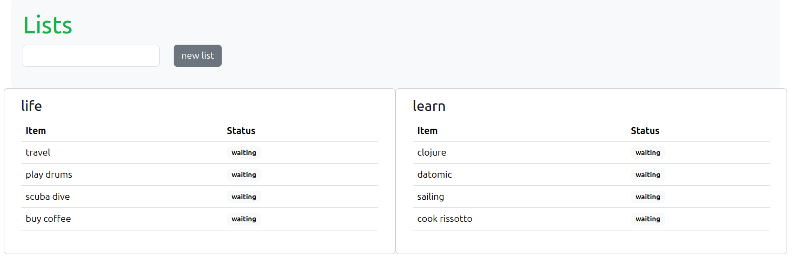

# Building a TODO List App with Clojure + Datomic Pro - [Part 3]

In [Part 2](../../part-2/todo-app/README.md) we completed the following:

- Serve a website with Pedestal and Hiccup
- Create a query to load the List and Items

Part 3 is about CRUD, you will explore the t/transact API to create, update and delete entities (List, Items). These are the actions that we want to support.

- Create list
- Delete list
- Add item to list
- Delete item
- Update item status

### Building the app


#### Create and Delete Lists

To start with, run the REPL in your editor or in the terminal.

```shell
clj
```

```shell
;; REPL
user>
```

As we are using native HTML we will user `forms` to make requests to the server. The form does a POST to `/lists` and it will include `new-list` argument with the name of the list

```clojure
(def new-list-form
 [:form {:action "/lists" :method "POST" :class "row row-cols-md-auto form-inline"}
  [:div {:class "col"} [:input {:type "text" :name "new-list" :class "form-control"}]]
  [:div {:class "col"} [:input {:type "submit" :value "new list" :class "btn btn-secondary btn-s"}]]])
```

The form does a POST to `/lists` and it will include `new-list` argument with the name of the list. Add the function to `src/server.clj`

```clojure
(ns server
  (:require
   [datomic.api :as d] ;; new
   [hiccup.page :as hp]
   [hiccup2.core :as h]
   [io.pedestal.http :as http]
   [io.pedestal.http.route :as route]
   [todo-db :as todo-db])) ;; new

(defn gen-page-head
  "Include bootstrap css"
  [title]
  [:head
   [:title title]
   (hp/include-css "https://cdn.jsdelivr.net/npm/bootstrap@5.3.3/dist/css/bootstrap.min.css")])

(def new-list-form ;; new
 [:form {:action "/lists" :method "POST" :class "row row-cols-md-auto form-inline"}
  [:div {:class "col"} [:input {:type "text" :name "new-list" :class "form-control"}]]
  [:div {:class "col"} [:input {:type "submit" :value "new list" :class "btn btn-secondary btn-s"}]]])

(defn all-lists-page
  "Renders the TODO list page"
  [_request]
  (str
   (h/html
    (gen-page-head "TODO App with Clojure + Datomic")
    [:div {:class "container"}
     [:div {:class "bg-light rounded-3" :style "padding: 20px"}
      [:h1 {:style "color: #1cb14a"} "Lists"]
      new-list-form] ;; new
     [:div {:class "row row-cols-2"}
      (for [list (todo-db/lists-page (d/db todo-db/conn)) ;; Important line
            :let [list-name (:list/name list)]]
        [:div {:class "col card"}
         [:div {:class "card-body"}
          [:h4 {:class "card-title"} list-name]
          [:table {:class "table mb-4"}
           [:thead
            [:tr
             [:th {:scope "col"} "Item"]
             [:th {:scope "col"} "Status"]]]
           [:tbody
            (for [item (:list/items list)
                  :let [item-text (get item :item/text)
                        item-status (get-in item [:item/status :db/ident])]] ;; new
              [:tr
               [:td item-text]
               [:td
                [:span {:class "badge text-bg-light"} item-status]]])]]]])]])))

(defn html-200 [body]
  {:status  200
   :headers {"Content-Type" "text/html; charset=utf-8"}
   :body    body})

(def routes
  (route/expand-routes
   #{["/" :get (comp html-200 all-lists-page) :route-name :home]}))

(defn create-server []
  (http/create-server
   {::http/routes routes
    ::http/secure-headers {:content-security-policy-settings "object-src 'none'; script-src 'self' 'unsafe-inline' 'unsafe-eval' https: http:;"}
    ::http/type :jetty
    ::http/port 8890
    ::http/join? false}))

(defonce server (atom nil))

(defn start-server []
  (reset! server (-> (create-server) http/start)))

(defn stop-server []
  (swap! server http/stop))

(defn restart-server []
  (stop-server)
  (start-server))
```

Load the file to the REPL and `(start-server)`

```clojure
;; Result
(start-server)
```

navigate to http://localhost:8890/ in the browser, you should see the new list text box area.



Receive the request in Pedestal routes and create a new list with the name received by the form. Add `[io.pedestal.http.body-params :as body-params]`in the `:require`, that namespace contains a function to parse `form-params` and it's used inside the routes. 

```clojure
(def routes
  (route/expand-routes
   #{["/" :get (comp html-200 all-lists-page) :route-name :home]
     ["/lists" :post [(body-params/body-params) new-list] :route-name :new-list]})) ;; new
```

*learn more about [Pedestal interceptors](https://pedestal.io/pedestal/0.7/guides/defining-routes.html#_interceptors)*

Interceptors are functions that can be composed, they receive the request context and the last function is a handler that will return the final response. In this case it's `new-list` , let's create it.

```clojure
(def html-302-response
  {:status    302
   :headers {"Content-Type" "text/html; charset=utf-8" "Location" "/"}
   :body    ""})

(defn new-list [{:keys [form-params] :as _request}]
  (let [list-name (:new-list form-params)]
    (d/transact todo-db/conn [(todo-db/new-list (d/db todo-db/conn) list-name)])
    html-302-response))
```

the function receives the the context from the Pedestal request, it access to the form-params and reads the `:new-list` key that contains the name inputted in the UI. Then it proceeds to transact to Datomic. The 302 status is returned because we want to comeback to the initial page and not to the path where the POST was made.

Add the function to `src/server.clj` 

```clojure
(ns server
  (:require
   [datomic.api :as d]
   [hiccup.page :as hp]
   [hiccup2.core :as h]
   [io.pedestal.http.body-params :as body-params] ;; new
   [io.pedestal.http :as http]
   [io.pedestal.http.route :as route]
   [todo-db :as todo-db]))

(defn gen-page-head
  "Include bootstrap css"
  [title]
  [:head
   [:title title]
   (hp/include-css "https://cdn.jsdelivr.net/npm/bootstrap@5.3.3/dist/css/bootstrap.min.css")])

(def new-list-form
 [:form {:action "/lists" :method "POST" :class "row row-cols-md-auto form-inline"}
  [:div {:class "col"} [:input {:type "text" :name "new-list" :class "form-control"}]]
  [:div {:class "col"} [:input {:type "submit" :value "new list" :class "btn btn-secondary btn-s"}]]])

(defn all-lists-page
  "Renders the TODO list page"
  [_request]
  (str
   (h/html
    (gen-page-head "TODO App with Clojure + Datomic")
    [:div {:class "container"}
     [:div {:class "bg-light rounded-3" :style "padding: 20px"}
      [:h1 {:style "color: #1cb14a"} "Lists"]
      new-list-form]
     [:div {:class "row row-cols-2"}
      (for [list (todo-db/lists-page (d/db todo-db/conn)) ;; Important line
            :let [list-name (:list/name list)]]
        [:div {:class "col card"}
         [:div {:class "card-body"}
          [:h4 {:class "card-title"} list-name]
          [:table {:class "table mb-4"}
           [:thead
            [:tr
             [:th {:scope "col"} "Item"]
             [:th {:scope "col"} "Status"]]]
           [:tbody
            (for [item (:list/items list)
                  :let [item-text (get item :item/text)
                        item-status (get-in item [:item/status :db/ident])]] ;; new
              [:tr
               [:td item-text]
               [:td
                [:span {:class "badge text-bg-light"} item-status]]])]]]])]])))

(def html-302-response ;; new
  {:status    302
   :headers {"Content-Type" "text/html; charset=utf-8" "Location" "/"}
   :body    ""})

(defn html-200 [body]
  {:status  200
   :headers {"Content-Type" "text/html; charset=utf-8"}
   :body    body})

(defn new-list [{:keys [form-params] :as _request}] ;;new
  (let [list-name (:new-list form-params)]
    (d/transact todo-db/conn [(todo-db/new-list list-name)])
    html-302-response))

(def routes
  (route/expand-routes
   #{["/" :get (comp html-200 all-lists-page) :route-name :home]
     ["/lists" :post [(body-params/body-params) new-list] :route-name :new-list]})) ;; new

(defn create-server []
  (http/create-server
   {::http/routes routes
    ::http/secure-headers {:content-security-policy-settings "object-src 'none'; script-src 'self' 'unsafe-inline' 'unsafe-eval' https: http:;"}
    ::http/type :jetty
    ::http/port 8890
    ::http/join? false}))

(defonce server (atom nil))

(defn start-server []
  (reset! server (-> (create-server) http/start)))

(defn stop-server []
  (swap! server http/stop))

(defn restart-server []
  (stop-server)
  (start-server))
```

load the file to the REPL and `(restart-server)`

```clojure
;; REPL
(restart-server)
```

now let's got to http://localhost:8890/ , we should see something like this.

GIF of creating a new list

Great, let's move on to `retraction` to represent the deletion of a list. For that we will [:retractEntity](https://docs.datomic.com/transactions/transaction-functions.html#dbfn-retractentity) function, it will receive the listeid and  itt retracts all the attribute values where the given entity id is either the entity or value, effectively retracting the entity's own data and any references to the entity as well.

```clojure
(defn retract-list [listeid]
  [:db/retractEntity listeid])
```
it's all about Datoms, we need to pass it to `d/transact`

```clojure
(defn retract-list [{:keys [path-params] :as _request}]
  (let [listeid (Long/parseLong (:list-id path-params))] ;; Datomic expects a Long and the path-params are received as string
    (d/transact todo-db/conn [(todo-db/retract-list listeid)])
    html-302-response))
```

then add the route and call the function

```clojure
(def routes
  (route/expand-routes
   #{["/" :get (comp html-200 all-lists-page) :route-name :home]
     ["/lists" :post [(body-params/body-params) new-list] :route-name :new-list]
     ["/lists/:list-id/retract" :post [(body-params/body-params) retract-list] :route-name :retract-list]})) ;; new
```

### Create and Delete Items

It's the same idea for the items, you need to add a transaction to add the new Datoms and a retraction to remove the item. Here is a list of the things that we will do

- Create a `new-item` function in the server.clj file.
- Add the `lists/:list-id/items/:item-id` route and call `new-item` handler function.
- Add Hiccup form to create a new item.
- Create a `retract-item` function in the server.clj file.
- Add the `lists/:list-id/items/:item-id/delete` route and call `retract-item` handler function.

Let's start with the creation of new items

```clojure
(defn new-item [{:keys [path-params form-params] :as _request}]
  (let [listeid (Long/parseLong (:list-id path-params))
        item-text (:new-item form-params)]
    (d/transact todo-db/conn [(todo-db/new-item (d/db todo-db/conn) listeid item-text)])
    html-302-response))
```

In the `path-params` we have access to the `listeid` and the current `todo-db/new-item` function expects the name, go to `src/todo_db.clj` and modify the new-item function to receive the `listeid` instead of the name

from 

```clojure
(defn new-item [db list-name item-text]
  (let [minify (clojure.string/replace item-text #" " "-")]
    {:db/id (d/entid db [:list/name list-name])
     :list/items [{:db/id  (str "item.temp." minify) ;; IMPORTANT line
                   :item/text item-text
                   :item/status :item.status/waiting}]}))
```

to

```clojure
(defn new-item [db listeid item-text] ;; list-name -> listeid
  (let [minify (clojure.string/replace item-text #" " "-")]
    {:db/id listeid ;; new
     :list/items [{:db/id  (str "item.temp." minify) ;; IMPORTANT line
                   :item/text item-text
                   :item/status :item.status/waiting}]}))
```

make sure to load the changes of `todo_db.clj` to the REPL. Now let's move to `src/server.clj` and add the route

```clojure
(def routes
  (route/expand-routes
   #{["/" :get (comp html-200 all-lists-page) :route-name :home]
     ["/lists" :post [(body-params/body-params) new-list] :route-name :new-list]
     ["/lists/:list-id/retract" :post [(body-params/body-params) retract-list] :route-name :retract-list]
     ["/lists/:list-id/items" :post [(body-params/body-params) new-item] :route-name :new-item]})) ;; new
```

to finish the creation of the item, add the new item form 

```clojure
(defn new-item-form [list-id]
  [:form {:action (str "/lists/" list-id "/items")
          :method "POST"
          :class "row row-cols-sm-auto form-inline"}
   [:div {:class "col"} [:input {:type "text" :name "new-item" :class "form-control"}]]
   [:div {:class "col"} [:input {:type "submit" :value "add" :class "btn btn-light btn-s"}]]])
```

and place it below the `[:h4 {:class "card-title"} list-name]`

```clojure
(defn all-lists-page
  "Renders the TODO list page"
  [_request]
  (str
   (h/html
    (gen-page-head "TODO App with Clojure + Datomic")
    [:div {:class "container"}
     [:div {:class "bg-light rounded-3" :style "padding: 20px"}
      [:h1 {:style "color: #1cb14a"} "Lists"]
      new-list-form]
     [:div {:class "row row-cols-2"}
      (for [list (todo-db/lists-page (d/db todo-db/conn)) ;; Important line
            :let [list-name (:list/name list)
                  list-id (:db/id list)]]
        [:div {:class "col card"}
         [:div {:class "card-body"}
          [:form {:action (str "/lists/" list-id "/retract") :method "POST" :class ""}
           [:input {:type "submit" :value "" :class "btn-close"}]]
          [:h4 {:class "card-title"} list-name]
          (new-item-form list-id) ;; new
          [:table {:class "table mb-4"}
           [:thead
            [:tr
             [:th {:scope "col"} "Item"]
             [:th {:scope "col"} "Status"]]]
           [:tbody
            (for [item (:list/items list)
                  :let [item-text (get item :item/text)
                        item-status (get-in item [:item/status :db/ident])]] ;; new
              [:tr
               [:td item-text]
               [:td
                [:span {:class "badge text-bg-light"} item-status]]])]]]])]])))
```

load the file to the REPL and `(restart-server)`

```clojure
;; REPL
(restart-server)
```

go to http://localhost:8890/ 

ADD GIF adding a new item

##### Retract item

Go to `src/todo_db.clj` and add the `retract-item` function

```clojure
(defn retract-item [itemeid]
  [:db/retractEntity itemeid])
```

And call it from `src/server.clj` 

```clojure
(defn retract-item [{:keys [path-params] :as _request}]
  (let [itemeid (Long/parseLong (:item-id path-params))]
    (d/transact todo-db/conn [(todo-db/retract-item itemeid)])
    html-302-response))
```

Now add the function call in the routes

```clojure
(def routes
  (route/expand-routes
   #{["/" :get (comp html-200 all-lists-page) :route-name :home]
     ["/lists" :post [(body-params/body-params) new-list] :route-name :new-list]
     ["/lists/:list-id/retract" :post [(body-params/body-params) retract-list] :route-name :retract-list]
     ["/lists/:list-id/items" :post [(body-params/body-params) new-item] :route-name :new-item]
     ["/lists/:list-id/items/:item-id/retract" :post [(body-params/body-params) retract-item] :route-name :retract-item]}))
```

finally add the Hiccup form to retract. For that add one more column to the table named `actions` here we will place the retract button and the transition to a different status.

```clojure
(defn all-lists-page
  "Renders the TODO list page"
  [_request]
  (str
   (h/html
    (gen-page-head "TODO App with Clojure + Datomic")
    [:div {:class "container"}
     [:div {:class "bg-light rounded-3" :style "padding: 20px"}
      [:h1 {:style "color: #1cb14a"} "Lists"]
      new-list-form]
     [:div {:class "row row-cols-2"}
      (for [list (todo-db/lists-page (d/db todo-db/conn))
            :let [list-name (:list/name list)
                  list-id (:db/id list)]]
        [:div {:class "col card"}
         [:div {:class "card-body"}
          [:form {:action (str "/lists/" list-id "/retract") :method "POST" :class ""}
           [:input {:type "submit" :value "" :class "btn-close"}]]
          [:h4 {:class "card-title"} list-name]
          (new-item-form list-id)
          [:table {:class "table mb-4"}
           [:thead
            [:tr
             [:th {:width "40%" :scope "col"} "Item"]
             [:th {:width "20%" :scope "col"} "Status"]
             [:th {:width "40%" :scope "col"} "Actions"]]]
           [:tbody
            (for [item (:list/items list)
                  :let [item-text (get item :item/text)
                        item-status (get-in item [:item/status :db/ident])
                        item-id (get item :db/id)]] ;;;;;;;;;; new ;;;;;;;;;;
              [:tr
               [:td item-text]
               [:td
                [:span {:class "badge text-bg-light"} item-status]]
               [:td ;;;;;;;;;;;;; new ;;;;;;;;;;;;;;;;
                [:div {:class "row"}
                 [:div {:class "col-sm-2 align-items-right"}
                  [:form {:action (str "/lists/" list-id "/items/" item-id "/retract") :method "POST"}
                     [:input {:type "submit" :value "X" :class "btn btn-sm btn-danger"}]]]]]])]]]])]])))
```

load the file to the REPL and `(restart-server)`

```clojure
;; REPL
(restart-server)
```

go to http://localhost:8890/  and refresh

ADD GIF DELETING ITEM

#### Update Item status

This section is about the transition of the Item status, we have three options `waiting`, `doing` ,`done`. We will show a dropdown button that allows you to choose the desired status and then make the request to the server. The server will receive the request then call the handler then make the transaction to the database and return 302 to make the refresh of the main page.

Go to `src/todo_db.clj` and add the `transition-item` function

```clojure
(def namespace-status (comp keyword (partial str "item.status/")))

(defn transition-item [itemeid to-status]
  [:db/add itemeid :item/status (namespace-status to-status)])
```

when we receive the status in the HTTP request it comes as string and without the `item.status` namespace, to adapt it so that it conveys with our defined schema enums we need to add the `item.status` namespace and convert it to a keyword. `namespace-status` function does that.

Load the file to the REPL and move to `src/server.clj`. Now create the `transition-item` handler function

```clojure
(defn transition-item [{:keys [path-params form-params] :as _request}]
  (let [itemeid (Long/parseLong (:item-id path-params))
        new-status (:new-status form-params)]
    (d/transact todo-db/conn [(todo-db/transition-item itemeid new-status)])
    html-302-response))
```

add the Pedestal route

```clojure
(def routes
  (route/expand-routes
   #{["/" :get (comp html-200 all-lists-page) :route-name :home]
     ["/lists" :post [(body-params/body-params) new-list] :route-name :new-list]
     ["/lists/:list-id/retract" :post [(body-params/body-params) retract-list] :route-name :retract-list]
     ["/lists/:list-id/items" :post [(body-params/body-params) new-item] :route-name :new-item]
     ["/lists/:list-id/items/:item-id/retract" :post [(body-params/body-params) retract-item] :route-name :retract-item]
     ["/lists/:list-id/items/:item-id/transition" :post [(body-params/body-params) transition-item] :route-name :transition-item]}))
```

finally add the form in the Hiccup code

```clojure
(defn todo-statuses-form [list-name todo]
  [:form {:action (str "/lists/" list-name "/todos/" (:db/id todo) "/transition")
          :method "POST"
          :class "row row-cols-lg-auto g-3 align-items-center"}
   [:div {:class "col"}
    [:select {:class "form-select" :id "floatingSelectGrid" :name "new-status"}
     [:option {:selected true} (get-in todo [:todo/status :db/ident])]
     [:option {:value "waiting"} "waiting"]
     [:option {:value "doing"} "doing"]
     [:option {:value "done"} "done"]]]
   [:div {:class "col"}
    [:input {:type "submit" :value "ok" :class "btn btn-sm btn-secondary "}]]])
```

then add it ito `all-lists-page`

```clojure
(defn all-lists-page
  "Renders the TODO list page"
  [_request]
  (str
   (h/html
    (gen-page-head "TODO App with Clojure + Datomic")
    [:div {:class "container"}
     [:div {:class "bg-light rounded-3" :style "padding: 20px"}
      [:h1 {:style "color: #1cb14a"} "Lists"]
      new-list-form]
     [:div {:class "row row-cols-2"}
      (for [list (todo-db/lists-page (d/db todo-db/conn))
            :let [list-name (:list/name list)
                  list-id (:db/id list)]]
        [:div {:class "col card"}
         [:div {:class "card-body"}
          [:form {:action (str "/lists/" list-id "/retract") :method "POST" :class ""}
           [:input {:type "submit" :value "" :class "btn-close"}]]
          [:h4 {:class "card-title"} list-name]
          (new-item-form list-id)
          [:table {:class "table mb-4"}
           [:thead
            [:tr
             [:th {:width "40%" :scope "col"} "Item"]
             [:th {:width "20%" :scope "col"} "Status"]
             [:th {:width "40%" :scope "col"} "Actions"]]]
           [:tbody
            (for [item (:list/items list)
                  :let [item-text (get item :item/text)
                        item-status (get-in item [:item/status :db/ident])
                        item-id (get item :db/id)]]
              [:tr
               [:td item-text]
               [:td
                [:span {:class "badge text-bg-light"} item-status]]
               [:td
                [:div {:class "row"}
                 [:div {:class "col-sm"} ;;;;;;;;;; new ;;;;;;;;;;;
                  (transition-item-form list-id item)]
                 [:div {:class "col-sm-2 align-items-right"}
                  [:form {:action (str "/lists/" list-id "/items/" item-id "/retract") :method "POST"}
                    [:input {:type "submit" :value "X" :class "btn btn-sm btn-danger"}]]]]]])]]]])]])))
```

load the file to the REPL and `(restart-server)` then go to http://localhost:8890/ and refresh

ADD GIF of UPDATE

### Final Code 

You can see the code in [src/server.clj](src/server.clj) and  [src/todo_db](src/todo_db). Also here is the final version of both files after all the code blocks seen in the tutorial

```clojure
(ns server
  (:require
   [datomic.api :as d]
   [hiccup.page :as hp]
   [hiccup2.core :as h]
   [io.pedestal.http.body-params :as body-params]
   [io.pedestal.http :as http]
   [io.pedestal.http.route :as route]
   [todo-db :as todo-db]))

(defn gen-page-head
  "Include bootstrap css"
  [title]
  [:head
   [:title title]
   (hp/include-css "https://cdn.jsdelivr.net/npm/bootstrap@5.3.3/dist/css/bootstrap.min.css")])

(def new-list-form
 [:form {:action "/lists" :method "POST" :class "row row-cols-md-auto form-inline"}
  [:div {:class "col"} [:input {:type "text" :name "new-list" :class "form-control"}]]
  [:div {:class "col"} [:input {:type "submit" :value "new list" :class "btn btn-secondary btn-s"}]]])

(defn new-item-form [list-id]
  [:form {:action (str "/lists/" list-id "/items") :method "POST" :class "row row-cols-sm-auto form-inline"}
   [:div {:class "col"} [:input {:type "text" :name "new-item" :class "form-control"}]]
   [:div {:class "col"} [:input {:type "submit" :value "add" :class "btn btn-light btn-s"}]]])

(defn transition-item-form [list-id item]
  [:form {:action (str "/lists/" list-id "/items/" (:db/id item) "/transition")
          :method "POST"
          :class "row row-cols-lg-auto g-3 align-items-center"}
   [:div {:class "col"}
    [:select {:class "form-select" :id "floatingSelectGrid" :name "new-status"}
     [:option {:selected true} (get-in item [:item/status :db/ident])]
     [:option {:value "waiting"} "waiting"]
     [:option {:value "doing"} "doing"]
     [:option {:value "done"} "done"]]]
   [:div {:class "col"}
    [:input {:type "submit" :value "ok" :class "btn btn-sm btn-secondary "}]]])

(defn all-lists-page
  "Renders the TODO list page"
  [_request]
  (str
   (h/html
    (gen-page-head "TODO App with Clojure + Datomic")
    [:div {:class "container"}
     [:div {:class "bg-light rounded-3" :style "padding: 20px"}
      [:h1 {:style "color: #1cb14a"} "Lists"]
      new-list-form]
     [:div {:class "row row-cols-2"}
      (for [list (todo-db/lists-page (d/db todo-db/conn))
            :let [list-name (:list/name list)
                  list-id (:db/id list)]]
        [:div {:class "col card"}
         [:div {:class "card-body"}
          [:form {:action (str "/lists/" list-id "/retract") :method "POST" :class ""}
           [:input {:type "submit" :value "" :class "btn-close"}]]
          [:h4 {:class "card-title"} list-name]
          (new-item-form list-id)
          [:table {:class "table mb-4"}
           [:thead
            [:tr
             [:th {:width "40%" :scope "col"} "Item"]
             [:th {:width "20%" :scope "col"} "Status"]
             [:th {:width "40%" :scope "col"} "Actions"]]]
           [:tbody
            (for [item (:list/items list)
                  :let [item-text (get item :item/text)
                        item-status (get-in item [:item/status :db/ident])
                        item-id (get item :db/id)]]
              [:tr
               [:td item-text]
               [:td
                [:span {:class "badge text-bg-light"} item-status]]
               [:td
                [:div {:class "row"}
                 [:div {:class "col-sm"}
                  (transition-item-form list-id item)]
                 [:div {:class "col-sm-2 align-items-right"}
                  [:form {:action (str "/lists/" list-id "/items/" item-id "/retract") :method "POST"}
                    [:input {:type "submit" :value "X" :class "btn btn-sm btn-danger"}]]]]]])]]]])]])))

(def html-302-response
  {:status    302
   :headers {"Content-Type" "text/html; charset=utf-8" "Location" "/"}
   :body    ""})

(defn html-200 [body]
  {:status  200
   :headers {"Content-Type" "text/html; charset=utf-8"}
   :body    body})

(defn new-list [{:keys [form-params] :as _request}]
  (let [list-name (:new-list form-params)]
    (d/transact todo-db/conn [(todo-db/new-list list-name)])
    html-302-response))

(defn retract-list [{:keys [path-params] :as _request}]
  (let [listeid (Long/parseLong (:list-id path-params))]
    (d/transact todo-db/conn [(todo-db/retract-list listeid)])
    html-302-response))

(defn new-item [{:keys [path-params form-params] :as _request}]
  (let [listeid (Long/parseLong (:list-id path-params))
        item-text (:new-item form-params)]
    (d/transact todo-db/conn [(todo-db/new-item (d/db todo-db/conn) listeid item-text)])
    html-302-response))

(defn retract-item [{:keys [path-params] :as _request}]
  (let [itemeid (Long/parseLong (:item-id path-params))]
    (d/transact todo-db/conn [(todo-db/retract-item itemeid)])
    html-302-response))

(defn transition-item [{:keys [path-params form-params] :as _request}]
  (let [itemeid (Long/parseLong (:item-id path-params))
        new-status (:new-status form-params)]
    (d/transact todo-db/conn [(todo-db/transition-item itemeid new-status)])
    html-302-response))

(def routes
  (route/expand-routes
   #{["/" :get (comp html-200 all-lists-page) :route-name :home]
     ["/lists" :post [(body-params/body-params) new-list] :route-name :new-list]
     ["/lists/:list-id/retract" :post [(body-params/body-params) retract-list] :route-name :retract-list]
     ["/lists/:list-id/items" :post [(body-params/body-params) new-item] :route-name :new-item]
     ["/lists/:list-id/items/:item-id/retract" :post [(body-params/body-params) retract-item] :route-name :retract-item]
     ["/lists/:list-id/items/:item-id/transition" :post [(body-params/body-params) transition-item] :route-name :transition-item]}))

(defn create-server []
  (http/create-server
   {::http/routes routes
    ::http/secure-headers {:content-security-policy-settings "object-src 'none'; script-src 'self' 'unsafe-inline' 'unsafe-eval' https: http:;"}
    ::http/type :jetty
    ::http/port 8890
    ::http/join? false}))

(defonce server (atom nil))

(defn start-server []
  (reset! server (-> (create-server) http/start)))

(defn stop-server []
  (swap! server http/stop))

(defn restart-server []
  (stop-server)
  (start-server))
```

#### Retract Item

### Resources

- [Pedestal routes](http://pedestal.io/pedestal/0.7/guides/defining-routes.html)
- [Hiccup basic syntax](https://github.com/weavejester/hiccup/wiki/Syntax)
- [Datomic - :db/ident](https://docs.datomic.com/schema/identity.html#idents)
- [Datomic - pull](https://docs.datomic.com/query/query-pull.html)